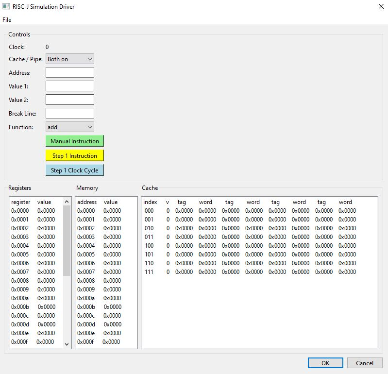

<!-----

You have some errors, warnings, or alerts. If you are using reckless mode, turn it off to see inline alerts.
* ERRORs: 0
* WARNINGs: 0
* ALERTS: 1

Conversion time: 1.214 seconds.

Using this Markdown file:

1. Paste this output into your source file.
2. See the notes and action items below regarding this conversion run.
3. Check the rendered output (headings, lists, code blocks, tables) for proper
   formatting and use a linkchecker before you publish this page.

Conversion notes:

* Docs to Markdown version 1.0β34
* Thu May 25 2023 07:43:13 GMT-0700 (PDT)
* Source doc: RISC-J README
* Tables are currently converted to HTML tables.
* This document has images: check for >>>>>  gd2md-html alert:  inline image link in generated source and store images to your server. NOTE: Images in exported zip file from Google Docs may not appear in  the same order as they do in your doc. Please check the images!

----->

>>>>>  gd2md-html alert:  ERRORs: 0; WARNINGs: 0; ALERTS: 1.

<ul style="color: red; font-weight: bold"><li>See top comment block for details on ERRORs and WARNINGs. <li>In the converted Markdown or HTML, search for inline alerts that start with >>>>>  gd2md-html alert:  for specific instances that need correction.</ul>

Links to alert messages:
<a href="#gdcalert1">alert1</a>

>>>>> PLEASE check and correct alert issues and delete this message and the inline alerts.

**RISC-J**

Sean Driscoll

This ISA is a general purpose architecture that is largely based on the RISC-V instruction set.

The word size is 16 bits, but with 32 bit instructions.

This means that when loading instructions into memory, each instruction is split in half to take up a total of 2 words (half-words) per instruction.

RISC-J uses 32 general-purpose integer registers, each with size 16 bits. All of the registers are accessible and modifiable by the programmer/code, but some have conventions that are highly encouraged to follow, such as the PC and the 2 instruction registers. (conventions expanded upon in registers section)

The memory is word-addressed and uses a Princeton memory organization.

All instructions are first stored into memory, to be later fetched 1 by 1, and then all the following data addresses are calculated using the offset of the instructions to make sure no instructions get overwritten. (though again there is nothing preventing the user from doing this if they really want to)

I am using a 5 stage pipeline (fetch, decode, execute, memory, write back) and a write-through-no-allocate cache with 8 lines of 4 words each.

Supported addressing modes:

- PC relative (PC + immediate)
- Register direct (rd = rs1 + rs2)
- Register offset (M[rs1 + immediate])

The instructions will be categorized into the following five formats:

- **R:** arithmetic / logic (add, xor, mu)
- **I: **immediate, loads (addi, lw)
- **S:** store (sw, sb)
- **C: **conditional / branch (beq, bge)
- **J: **jump (jal, jalr)

_Note: I have decided to leave out RISC-V’s U-type instructions for simplicity_

_And I changed some of the format letters for my super creative name :)_

**R-Format (Opcode: 0000)**

**General format:**

Field names and sizes:

<table>
  <tr>
   <td><strong>no-op</strong>
   </td>
   <td><strong>rs2</strong>
   </td>
   <td><strong>rs1</strong>
   </td>
   <td><strong>function</strong>
   </td>
   <td><strong>rd</strong>
   </td>
   <td><strong>opcode</strong>
   </td>
  </tr>
  <tr>
   <td><strong>31:23</strong>
   </td>
   <td><strong>22:18</strong>
   </td>
   <td><strong>17:13</strong>
   </td>
   <td><strong>12:9</strong>
   </td>
   <td><strong>8:4</strong>
   </td>
   <td><strong>3:0</strong>
   </td>
  </tr>
</table>

**Instructions:**

<table>
  <tr>
   <td>Instruction
   </td>
   <td>Name
   </td>
   <td>Function
   </td>
   <td>Description
   </td>
  </tr>
  <tr>
   <td>add
   </td>
   <td>ADD
   </td>
   <td>0000
   </td>
   <td>rd = rs1 + rs2
   </td>
  </tr>
  <tr>
   <td>sub
   </td>
   <td>SUB
   </td>
   <td>0001
   </td>
   <td>rd = rs1 - rs2
   </td>
  </tr>
  <tr>
   <td>mul
   </td>
   <td>MUL
   </td>
   <td>0010
   </td>
   <td>rd = rs1 * rs2
   </td>
  </tr>
  <tr>
   <td>div
   </td>
   <td>DIV
   </td>
   <td>0011
   </td>
   <td>Rd = rs1 / rs2
   </td>
  </tr>
  <tr>
   <td>mod
   </td>
   <td>MOD
   </td>
   <td>0100
   </td>
   <td>rd = rs1 % rs2
   </td>
  </tr>
  <tr>
   <td>xor
   </td>
   <td>XOR
   </td>
   <td>0101
   </td>
   <td>rd = rs1 ^ rs2
   </td>
  </tr>
  <tr>
   <td>or
   </td>
   <td>OR
   </td>
   <td>0110
   </td>
   <td>rd = rs1 | rs2
   </td>
  </tr>
  <tr>
   <td>and
   </td>
   <td>AND
   </td>
   <td>0111
   </td>
   <td>rd = rs1 & rs2
   </td>
  </tr>
  <tr>
   <td>sll
   </td>
   <td>Shift Left Logical
   </td>
   <td>1000
   </td>
   <td>rd = rs1 &lt;< rs2
   </td>
  </tr>
  <tr>
   <td>srl
   </td>
   <td>Shift Right Logical
   </td>
   <td>1001
   </td>
   <td>rd = rs1 >> rs2
   </td>
  </tr>
</table>

**I-format (Opcode: 0001)**

**General format:**

<table>
  <tr>
   <td><strong>immediate</strong>
   </td>
   <td><strong>rs1</strong>
   </td>
   <td><strong>function</strong>
   </td>
   <td><strong>rd</strong>
   </td>
   <td><strong>opcode</strong>
   </td>
  </tr>
  <tr>
   <td><strong>31:18</strong>
   </td>
   <td><strong>17:13</strong>
   </td>
   <td><strong>12:9</strong>
   </td>
   <td><strong>8:4</strong>
   </td>
   <td><strong>3:0</strong>
   </td>
  </tr>
</table>

**Instructions:**

<table>
  <tr>
   <td>Instruction
   </td>
   <td>Name
   </td>
   <td>Function
   </td>
   <td>Description
   </td>
  </tr>
  <tr>
   <td>addi
   </td>
   <td>Add immediate
   </td>
   <td>0000
   </td>
   <td>Rd = rs1 + imm
   </td>
  </tr>
  <tr>
   <td>xori
   </td>
   <td>Xor immediate
   </td>
   <td>0001
   </td>
   <td>Rd = rs1 ^ imm
   </td>
  </tr>
  <tr>
   <td>ori
   </td>
   <td>Or immediate
   </td>
   <td>0010
   </td>
   <td>Rd = rs1 || imm
   </td>
  </tr>
  <tr>
   <td>andi
   </td>
   <td>And immediate
   </td>
   <td>0011
   </td>
   <td>Rd = rs1 && imm
   </td>
  </tr>
  <tr>
   <td>slli
   </td>
   <td>Logical left shift immediate
   </td>
   <td>0100
   </td>
   <td>Rd = rs1 &lt;< imm[0:4]
   </td>
  </tr>
  <tr>
   <td>srli
   </td>
   <td>Logical right shift immediate
   </td>
   <td>0101
   </td>
   <td>Rd = rs1 >> imm[0:4]
   </td>
  </tr>
</table>

**S-format (Opcode: 0011)**

**General format:**

<table>
  <tr>
   <td><strong>immediate</strong>
   </td>
   <td><strong>rs2</strong>
   </td>
   <td><strong>rs1</strong>
   </td>
   <td><strong>function</strong>
   </td>
   <td><strong>opcode</strong>
   </td>
  </tr>
  <tr>
   <td><strong>31:18</strong>
   </td>
   <td><strong>17:13</strong>
   </td>
   <td><strong>12:8</strong>
   </td>
   <td><strong>7:4</strong>
   </td>
   <td><strong>3:0</strong>
   </td>
  </tr>
</table>

**Instructions:**

<table>
  <tr>
   <td>Instruction
   </td>
   <td>Name
   </td>
   <td>Function
   </td>
   <td>Description
   </td>
  </tr>
  <tr>
   <td>sb
   </td>
   <td>Store Byte
   </td>
   <td>0000
   </td>
   <td>M[rs1+imm][0:7] = rs2[0:7]
   </td>
  </tr>
  <tr>
   <td>sh
   </td>
   <td>Store Half
   </td>
   <td>0001
   </td>
   <td>M[rs1+imm][0:15] = rs2[0:15]
   </td>
  </tr>
  <tr>
   <td>sw
   </td>
   <td>Store Word
   </td>
   <td>0010
   </td>
   <td>M[rs1+imm][0:31] = rs2[0:31]
   </td>
  </tr>
  <tr>
   <td>lb
   </td>
   <td>Load Byte
   </td>
   <td>0011
   </td>
   <td>Rs2 =M[rs1+imm][0:7] 
   </td>
  </tr>
  <tr>
   <td>lh
   </td>
   <td>Load Half
   </td>
   <td>0100
   </td>
   <td>Rs2 = M[rs1 + imm][0:15]
   </td>
  </tr>
  <tr>
   <td>lw
   </td>
   <td>Load Word
   </td>
   <td>0101
   </td>
   <td>Rs2 = M[rs1 + imm][0:31]
   </td>
  </tr>
</table>

**C-format (Opcode: 0100):**

**General format:**

<table>
  <tr>
   <td><strong>sign</strong>
   </td>
   <td><strong>immediate</strong>
   </td>
   <td><strong>rs2</strong>
   </td>
   <td><strong>rs1</strong>
   </td>
   <td><strong>function</strong>
   </td>
   <td><strong>opcode</strong>
   </td>
  </tr>
  <tr>
   <td><strong>31</strong>
   </td>
   <td><strong>30:18</strong>
   </td>
   <td><strong>17:13</strong>
   </td>
   <td><strong>12:8</strong>
   </td>
   <td><strong>7:4</strong>
   </td>
   <td><strong>3:0</strong>
   </td>
  </tr>
</table>

**Instructions:**

<table>
  <tr>
   <td>Instruction
   </td>
   <td>Name
   </td>
   <td>Function
   </td>
   <td>Description
   </td>
  </tr>
  <tr>
   <td>beq
   </td>
   <td>Branch ==
   </td>
   <td>0000
   </td>
   <td>if (rs1 == rs2) PC += imm
   </td>
  </tr>
  <tr>
   <td>bne
   </td>
   <td>Branch !=
   </td>
   <td>0001
   </td>
   <td>if (rs1 != rs2) PC += imm
   </td>
  </tr>
  <tr>
   <td>blt
   </td>
   <td>Branch &lt;
   </td>
   <td>0010
   </td>
   <td>if (rs1 &lt; rs2) PC += imm
   </td>
  </tr>
  <tr>
   <td>bge
   </td>
   <td>Branch ≥
   </td>
   <td>0011
   </td>
   <td>if (rs1 ≥ rs2) PC += imm
   </td>
  </tr>
</table>

(The sign bit for C and J instructions indicates forward jump on 0, backwards jump on 1)

**J-format (Opcode: 0101):**

**General format:**

<table>
  <tr>
   <td><strong>sign</strong>
   </td>
   <td><strong>immediate</strong>
   </td>
   <td><strong>rd</strong>
   </td>
   <td><strong>function</strong>
   </td>
   <td><strong>opcode</strong>
   </td>
  </tr>
  <tr>
   <td><strong>31</strong>
   </td>
   <td><strong>30:10</strong>
   </td>
   <td><strong>9:5</strong>
   </td>
   <td><strong>4</strong>
   </td>
   <td><strong>3:0</strong>
   </td>
  </tr>
</table>

**Instructions:**

<table>
  <tr>
   <td>Instruction
   </td>
   <td>Name
   </td>
   <td>Function
   </td>
   <td>Description
   </td>
  </tr>
  <tr>
   <td>jal
   </td>
   <td>Jump and Link
   </td>
   <td>0
   </td>
   <td>rd = PC+4; PC += imm
   </td>
  </tr>
  <tr>
   <td>jalr
   </td>
   <td>Jump and Link Reg
   </td>
   <td>1
   </td>
   <td>rd = PC+4; PC = rs1 + imm
   </td>
  </tr>
</table>

**Registers:**

**32 general purpose 16 bit integer registers**

Note that these are all only convention and can be modified (empty cells are completely general purpose)

<table>
  <tr>
   <td><strong>0x0000</strong>
   </td>
   <td>Hardwired zero
   </td>
  </tr>
  <tr>
   <td><strong>0x0001</strong>
   </td>
   <td>PC
   </td>
  </tr>
  <tr>
   <td><strong>0x0002</strong>
   </td>
   <td>IR that stores upper 16 bits of 32 bit instruction
   </td>
  </tr>
  <tr>
   <td><strong>0x0003</strong>
   </td>
   <td>IR that stores lower 16 bits of 32 bit instruction
   </td>
  </tr>
  <tr>
   <td><strong>0x0004</strong>
   </td>
   <td>Stack Pointer
   </td>
  </tr>
  <tr>
   <td><strong>0x0005</strong>
   </td>
   <td>Return Address
   </td>
  </tr>
  <tr>
   <td><strong>0x0006</strong>
   </td>
   <td>
   </td>
  </tr>
  <tr>
   <td><strong>0x0007</strong>
   </td>
   <td>
   </td>
  </tr>
  <tr>
   <td><strong>0x0008</strong>
   </td>
   <td>
   </td>
  </tr>
  <tr>
   <td><strong>0x0009</strong>
   </td>
   <td>
   </td>
  </tr>
  <tr>
   <td><strong>0x000a</strong>
   </td>
   <td>
   </td>
  </tr>
  <tr>
   <td><strong>0x000b</strong>
   </td>
   <td>
   </td>
  </tr>
  <tr>
   <td><strong>0x000c</strong>
   </td>
   <td>
   </td>
  </tr>
  <tr>
   <td><strong>0x000d</strong>
   </td>
   <td>
   </td>
  </tr>
  <tr>
   <td><strong>0x000e</strong>
   </td>
   <td>
   </td>
  </tr>
  <tr>
   <td><strong>0x000f</strong>
   </td>
   <td>
   </td>
  </tr>
  <tr>
   <td><strong>0x0010</strong>
   </td>
   <td>
   </td>
  </tr>
  <tr>
   <td><strong>0x0011</strong>
   </td>
   <td>
   </td>
  </tr>
  <tr>
   <td><strong>0x0012</strong>
   </td>
   <td>
   </td>
  </tr>
  <tr>
   <td><strong>0x0013</strong>
   </td>
   <td>
   </td>
  </tr>
  <tr>
   <td><strong>0x0014</strong>
   </td>
   <td>
   </td>
  </tr>
  <tr>
   <td><strong>0x0015</strong>
   </td>
   <td>
   </td>
  </tr>
  <tr>
   <td><strong>0x0016</strong>
   </td>
   <td>
   </td>
  </tr>
  <tr>
   <td><strong>0x0017</strong>
   </td>
   <td>
   </td>
  </tr>
  <tr>
   <td><strong>0x0018</strong>
   </td>
   <td>
   </td>
  </tr>
  <tr>
   <td><strong>0x0019</strong>
   </td>
   <td>
   </td>
  </tr>
  <tr>
   <td><strong>0x001a</strong>
   </td>
   <td>
   </td>
  </tr>
  <tr>
   <td><strong>0x001b</strong>
   </td>
   <td>
   </td>
  </tr>
  <tr>
   <td><strong>0x001c</strong>
   </td>
   <td>
   </td>
  </tr>
  <tr>
   <td><strong>0x001d</strong>
   </td>
   <td>
   </td>
  </tr>
  <tr>
   <td><strong>0x001e</strong>
   </td>
   <td>
   </td>
  </tr>
  <tr>
   <td><strong>0x001f</strong>
   </td>
   <td>
   </td>
  </tr>
</table>

**Assembly Syntax:**

All 32 registers can be accessed using the form rN, where N is the number (0-31) corresponding to the register. For example: to access the value in the last register, 0x001f, we would use ‘r31’

As such, it is up to the programmer to reference the conventions above to avoid messing with the “non-general purpose” registers such as program counter and instruction registers.

The instruction formats are as follows:

**R-Format:**

Instruction rd, rs1, rs2

**I-Format:**

Instruction rd, rs1, immediate

**S-Format:**

Instruction rs1, rs2, immediate

**C-Format:**

Instruction rs1, rs2, immediate

**J-Format:**

Instruction rd, immediate

For example, to add values from registers 29 and 30 and store the result in register 31:

add r31, r29, r30

The assembler allows comments to be made with a preceding ‘#’

For example, the following line will be ignored by the assembler and will not translate to binary:

`# This is a cool loop`

**Simulator**

This is what the GUI will look like when you launch the RISC-J simulator for the first time:

The ‘File’ dropdown menu allows you to open a binary file from your computer to run through the simulator.

**Controls:**

Clock: keeps track of the clock cycles since the program started. This version of the simulator can precisely show the clock cycle at any point in the program’s execution. It increments the clock by 1 repeatedly as it cycles through the pipeline, rather than increasing it by a constant every memory/cache access like the previous versions.

Cache / Pipe: This dropdown menu allows you to select whether you want cache, pipeline, both, or neither to be active during the current simulation. This allows the user to test the effectiveness of each feature and see which programs rely on each one more.

Address, Value1, & Value2: These input boxes can be used along with the function dropdown to specify values for manual instructions. Can be useful for debugging!

Example: Address: 0x000f Value: 0x0001 Function: sh

When you click the green ‘Manual Instruction’ button with the above combination, the simulator will store half-word 0x0001 at address 0x000f in memory

Break Line: Specify a line for the program to break at and allow you to view and/or manipulate the current state of all data._ Note_: you should enter a break line before opening a binary file from the file menu if you want to break before the program executes to completion. Then once you reach that break point, you can specify a new one. If you want to run to completion after a break, simply open the file again (you don’t need to navigate the file system again, clicking open will automatically resume the program from where you left off)

Step 1 Buttons: The ‘Step 1 Instruction’ button will break the program at the start of the next instruction (could be multiple clock cycles due to pipeline latency). The ‘Step 1 Clock Cycle’ button will break the program at the start of the next clock cycle.

**Data:**

There are three data windows that display the registers, memory, and cache, respectively.

All addresses and values in the registers, memory, and cache are displayed as 4 digit hexadecimal values preceded with 0x, with the exception of the cache’s indices and valid bits. Indices are a 3 digit binary number and valid bits are, well, bits. For simplicity and readability, the memory window starts off showing empty values for 15 addresses, but may (and probably will) be expanded upon. Addresses are always displayed in ascending order, but do not necessarily have to be sequential. Register values, on the other hand, always display all 32 registers. The cache is also a static size, and pre-filled with emptiness. It is displaying an 8 line, 4 word per line, write-through-no-allocate L1 cache.
